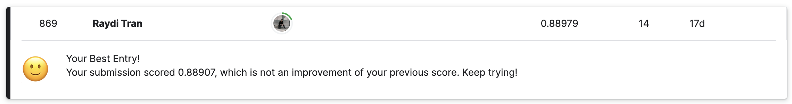

Steel Plate Defect Prediction
=====

Welcome to my first ever Kaggle competition repository. A series of repos where I applied my Machine Learning skills into these Kaggle competition.

As you can see, my first entry was not good 😭. But this fun competition really helped me learn a lots more about ML. If you're interested you can check out my second Kaggle competition [repo](https://github.com/raydiwill/Abalone-Regression-KaggleC) where it did better than this 🥳. 

See you soon :D